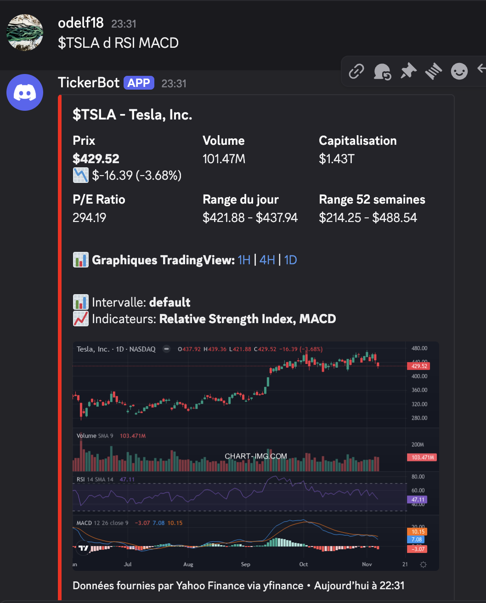
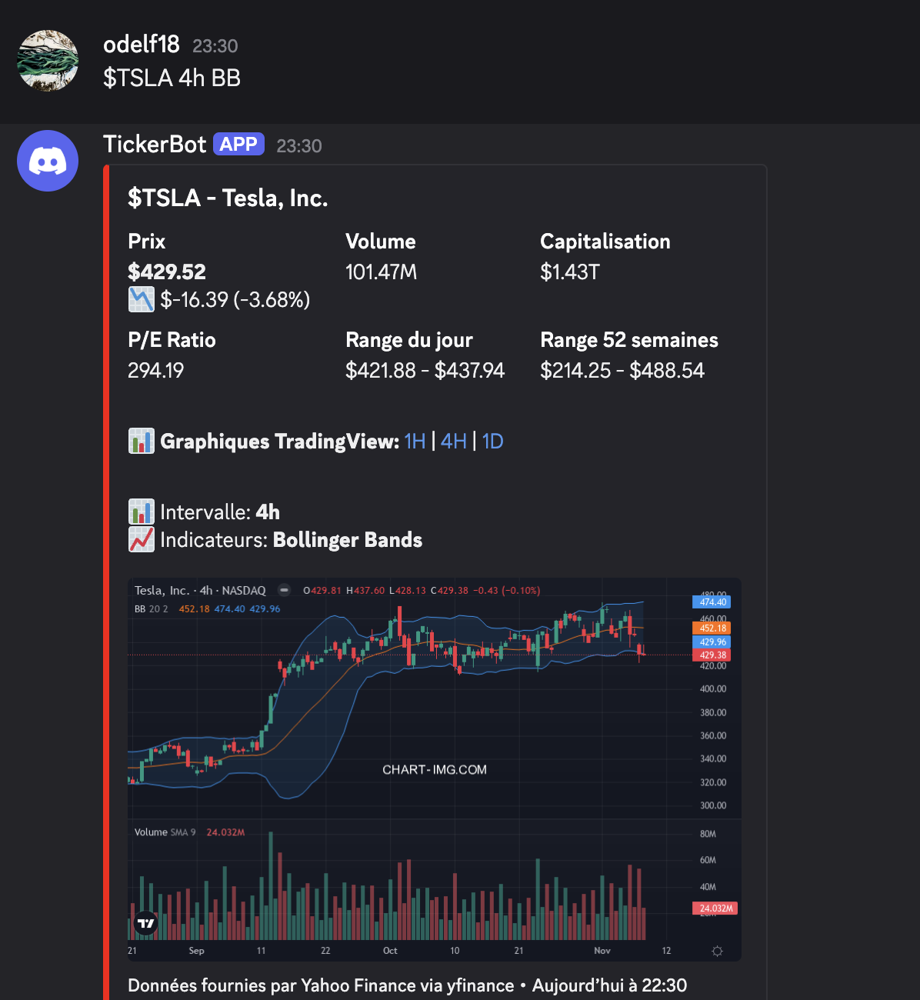

# Discord Stock Ticker Bot

[](https://www.python.org/downloads/)
[](https://github.com/Rapptz/discord.py)
[](LICENSE)
[](https://github.com/psf/black)

A powerful Discord bot that automatically detects stock ticker symbols in messages and provides real-time market data with interactive TradingView charts. Built with discord.py and featuring advanced technical analysis capabilities.

## Screenshots

### Basic Stock Information


### Advanced Technical Analysis


## Features

- **Automatic Detection** - Simply type `$AAPL` in any channel and get instant stock data
- **Real-time Market Data** - Current price, volume, market cap, P/E ratio, and more via Yahoo Finance
- **Embedded TradingView Charts** - High-quality candlestick charts displayed directly in Discord
- **Customizable Timeframes** - From 1-minute to monthly charts
- **Technical Indicators** - Support for 15+ technical indicators (RSI, MACD, EMA, Bollinger Bands, etc.)
- **Intelligent Caching** - 5-minute cache to optimize API usage and response time
- **100% Free** - Uses free APIs with generous rate limits

## Quick Start

### Prerequisites

- Python 3.10 or higher
- Discord Bot Token ([Create one here](https://discord.com/developers/applications))
- Internet connection

### Installation

1. Clone the repository
```bash
git clone https://github.com/yourusername/discord-stock-bot.git
cd discord-stock-bot
```

2. Create a virtual environment
```bash
python3 -m venv venv
source venv/bin/activate  # On Windows: venv\Scripts\activate
```

3. Install dependencies
```bash
pip install -r requirements.txt
```

4. Configure environment variables
```bash
cp .env.example .env
```

Edit `.env` and add your Discord bot token:
```env
DISCORD_TOKEN=your_discord_bot_token_here
```

5. Run the bot
```bash
python main.py
```

## Usage

### Basic Syntax

```
$AAPL                  → 1-day chart with volume indicator
```

### Advanced Syntax - Timeframes

Specify a custom timeframe after the ticker symbol:

```
$TSLA 1m               → 1-minute chart
$AAPL 5m               → 5-minute chart
$MSFT 15m              → 15-minute chart
$GOOGL 1h              → 1-hour chart
$NVDA 4h               → 4-hour chart
$META 1d               → 1-day chart
$AMZN 1w               → 1-week chart
```

**Supported Timeframes:**
- Seconds: `1s`, `5s`, `10s`, `15s`, `30s`
- Minutes: `1m`, `3m`, `5m`, `15m`, `30m`, `45m`
- Hours: `1h`, `2h`, `3h`, `4h`, `6h`, `8h`, `12h`
- Days: `1d`, `d`, `1day`
- Weeks: `1w`, `w`, `1week`
- Months: `1M`, `M`, `1month`

### Advanced Syntax - Technical Indicators

Add technical indicators after the timeframe:

```
$AAPL 1h EMA                    → 1h with Exponential Moving Average
$TSLA 4h RSI                    → 4h with Relative Strength Index
$MSFT 1d MACD                   → 1d with MACD
$GOOGL 1h Bollinger             → 1h with Bollinger Bands
$NVDA 4h EMA,RSI                → 4h with EMA and RSI
$META 1d RSI MACD               → 1d with RSI and MACD
```

**Supported Indicators:**
- Moving Averages: `EMA`, `SMA`, `WMA`
- Oscillators: `RSI`, `MACD`, `Stoch`, `CCI`
- Bands: `BB` (Bollinger), `Bollinger`
- Volume: `Volume`, `Vol`, `OBV`
- Trend: `ADX`, `Ichimoku`
- Other: `ATR`

### Real-world Examples

```
Check out $AAPL 1h RSI, it's overbought!
$TSLA 4h shows a strong uptrend
Compare $MSFT 1d EMA and $GOOGL 1d EMA
The $NVDA 15m Bollinger shows high volatility
```

### Manual Commands

```
!stock AAPL            → Get stock info (default 1d chart)
!ticker TSLA           → Alias for !stock
!s NVDA                → Short alias
```

Note: Manual commands do not support custom timeframes or indicators yet.

## Optional - Embedded Charts

By default, the bot provides clickable TradingView links. To enable embedded chart images:

1. Create a free account at [chart-img.com](https://chart-img.com)
2. Sign in with Google and copy your API key
3. Add it to your `.env` file:
```env
CHARTIMG_API_KEY=your_api_key_here
USE_EMBEDDED_CHARTS=true
```

4. Restart the bot

For detailed configuration instructions, see [CHART_SETUP.md](CHART_SETUP.md).

## Configuration

All configuration options are in `config.py`:

| Parameter | Description | Default |
|-----------|-------------|---------|
| `TICKER_PATTERN` | Regex for basic ticker detection | `\$([A-Z]{1,5})\b` |
| `ADVANCED_TICKER_PATTERN` | Regex for advanced syntax | Complex pattern |
| `TIMEFRAME_MAPPING` | User input to TradingView format | 30+ mappings |
| `TECHNICAL_INDICATORS` | Available technical indicators | 15+ indicators |
| `CACHE_EXPIRY_SECONDS` | Cache duration | 300s (5 min) |
| `EMBED_COLOR_GREEN` | Positive price change color | `0x00ff00` |
| `EMBED_COLOR_RED` | Negative price change color | `0xff0000` |

## Architecture

```
discord-stock-bot/
├── main.py                    # Bot entry point
├── config.py                  # Configuration settings
├── requirements.txt           # Python dependencies
├── .env                       # Environment variables (not in git)
├── .env.example              # Environment template
├── .gitignore                # Git ignore rules
├── README.md                 # This file
├── CHART_SETUP.md            # Chart configuration guide
├── cogs/
│   ├── __init__.py
│   └── stock_ticker.py       # Ticker detection and response logic
└── utils/
    ├── __init__.py
    └── tradingview.py        # TradingView chart generation
```

## APIs Used

### 1. yfinance (Stock Market Data)
- **Source:** Yahoo Finance
- **Cost:** Free
- **Rate Limit:** Unlimited (with caching recommended)
- **Data:** Price, volume, market cap, P/E ratio, 52-week range, etc.
- **Documentation:** [pypi.org/project/yfinance](https://pypi.org/project/yfinance/)

### 2. chart-img.com (Chart Images - Optional)
- **Type:** TradingView chart screenshot API
- **Cost:** Free tier available
- **Limit:** 800x600px resolution (free tier)
- **Advantage:** Embedded images in Discord
- **Documentation:** [doc.chart-img.com](https://doc.chart-img.com/)

### 3. TradingView (Chart Links - Always Available)
- **Type:** Direct URLs to interactive charts
- **Cost:** Free
- **Limit:** Unlimited
- **Advantage:** Professional interactive charts with full TradingView features

## Technical Details

### Pattern Recognition

The bot uses advanced regex patterns to parse natural language:

```python
# Basic pattern
TICKER_PATTERN = r'\$([A-Z]{1,5})\b'

# Advanced pattern (timeframe + indicators)
ADVANCED_TICKER_PATTERN = r'\$([A-Z]{1,5})(?:\s+(\d+[smhdwMy]))?(?:\s+([A-Za-z,\s]+))?'
```

### Caching Strategy

Uses LRU cache with time-based buckets to minimize API calls:
- Cache size: 100 ticker symbols
- Cache duration: 5 minutes (configurable)
- Automatic cache invalidation

### Discord Integration

- **Event-driven architecture** with cogs for modularity
- **Embed-based responses** for rich formatting
- **File attachments** for chart images
- **Rate limiting protection** to prevent spam

## Performance

- **Response time:** < 2 seconds for cached data
- **Response time:** 3-5 seconds for fresh API calls with charts
- **Concurrent requests:** Supports multiple simultaneous ticker requests
- **Memory usage:** ~50-100 MB (depends on cache size)

## Troubleshooting

### Bot doesn't respond to messages

1. Verify `MESSAGE CONTENT INTENT` is enabled in Discord Developer Portal
2. Check bot permissions (Send Messages, Embed Links, Attach Files)
3. Review console logs for errors

### Error: "DISCORD_TOKEN not found"

1. Ensure `.env` file exists in project root
2. Verify token is correctly set (no spaces)
3. Check virtual environment is activated

### Charts not displaying as images

1. Verify `CHARTIMG_API_KEY` is set in `.env`
2. Ensure `USE_EMBEDDED_CHARTS=true`
3. Restart the bot after configuration changes
4. Check console for API errors

See [CHART_SETUP.md](CHART_SETUP.md) for detailed chart configuration.

## Known Limitations

1. **yfinance unofficial API** - Uses Yahoo Finance's public API which may change
2. **US markets focus** - Optimized for NYSE and NASDAQ (international support limited)
3. **Slight data delay** - Free tier may have 15-20 minute delays on some markets
4. **Exchange detection** - Uses predefined list for NASDAQ/NYSE determination

## Roadmap

- [ ] Cryptocurrency support (BTC, ETH, etc.)
- [ ] Advanced technical analysis (Fibonacci, support/resistance)
- [ ] Price alerts and notifications
- [ ] Personal watchlists per user
- [ ] International markets (LSE, TSE, etc.)
- [ ] Multi-ticker comparison charts
- [ ] Historical data and performance metrics
- [ ] Portfolio tracking

## Contributing

Contributions are welcome! Please follow these guidelines:

1. Fork the repository
2. Create a feature branch (`git checkout -b feature/AmazingFeature`)
3. Commit your changes (`git commit -m 'Add some AmazingFeature'`)
4. Push to the branch (`git push origin feature/AmazingFeature`)
5. Open a Pull Request

## License

This project is licensed under the MIT License - see the [LICENSE](LICENSE) file for details.

## Disclaimer

This bot provides information for educational and informational purposes only. It is not financial advice. Always conduct your own research before making investment decisions.

## Acknowledgments

- [discord.py](https://github.com/Rapptz/discord.py) - Python Discord API wrapper
- [yfinance](https://github.com/ranaroussi/yfinance) - Yahoo Finance market data downloader
- [TradingView](https://www.tradingview.com/) - Professional charting platform
- [chart-img.com](https://chart-img.com/) - TradingView chart screenshot API

## Support

For issues and questions:
- Open an issue on GitHub
- Check existing issues for solutions
- Review the documentation and troubleshooting section

---

**Built with Python** | **Powered by discord.py** | **Market data by yfinance** | **Charts by TradingView**
